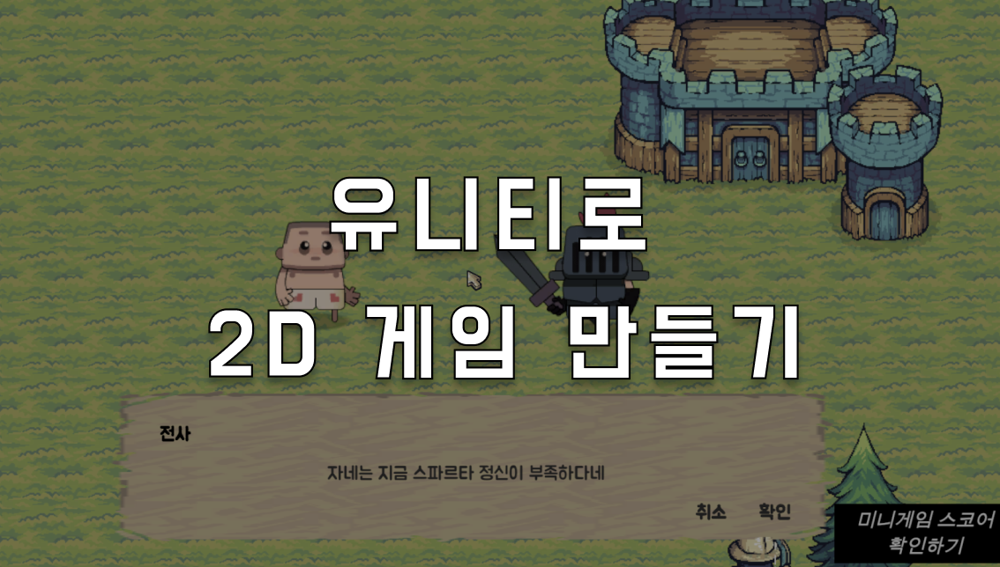

# 스파르타 코딩클럽 부트캠프 유니티 입문 과제
유니티를 통한 미니 게임 메타버스 만들기

[구현된 사항]

[추가 구현 예정 사항]
비행기 게임
- 비행기 게임에 코인 추가하기
- 스코어 또는 난이도에 따른 장애물 위치와 갯수 변동

[코드 개선]
- 스켈레톤 코드 작성(일관성 유지하도록)
- 기존의 코드에서 개발 이론(클린코드, 디자인 패턴) 적용하여 이해 및 개선

[폴더 구조]
```js
Assets
├── Fonts           // 공통으로 사용하는 리소스 (현재 폰트만 포함)
└── Scenes          // 각 미니 게임을 기준으로 우선 분류
    ├── World
    ├── Stack
    ├── Plane
    ├── Dungeon
    ├── Fishing
    └── ...   
        ├── Prefabs  // 프리팹 모음
        ├── Scripts  // 스크립트 파일
        │   ├── Object  // 개별 오브젝트 관련 스크립트
        │   ├── System  // 시스템 및 로직 관련 스크립트
        │   └── UI      // UI 관련 스크립트
        └── ...        // 기타 리소스
```

