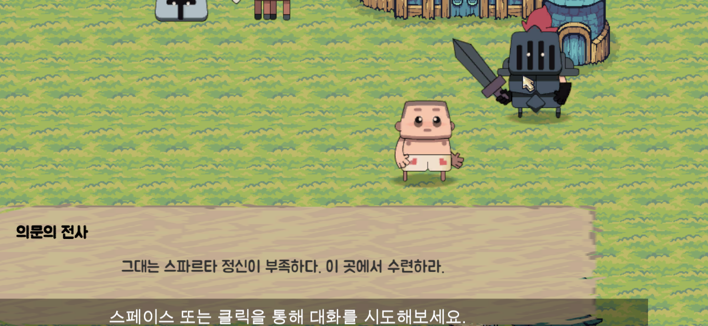
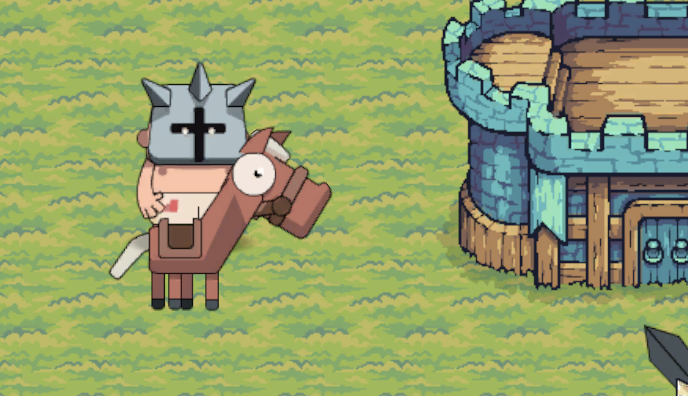
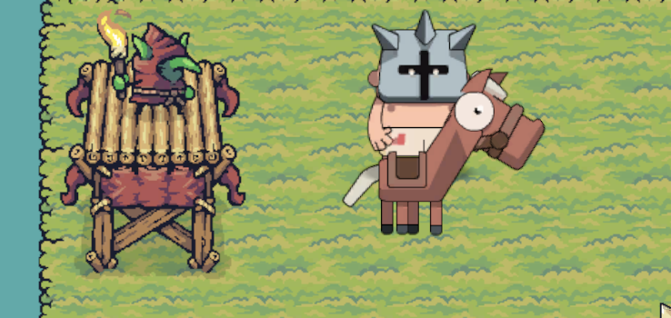
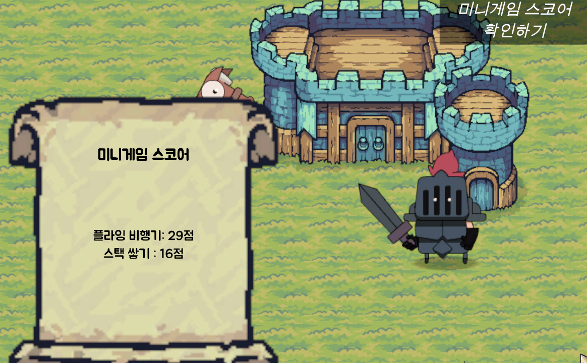

## 스파르타 코딩클럽 부트캠프 유니티 입문 과제
설명 : 유니티를 통한 미니 게임 메타버스 만들기

> 기획 단계

[추가 구현 목표]

비행기 게임
- 비행기 게임에 코인 추가하기
- 스코어 또는 난이도에 따른 장애물 위치와 갯수 변동

[코드 개선]
- 스켈레톤 코드 작성(일관성 유지하도록)
- 기존의 코드에서 개발 이론(클린코드, 디자인 패턴) 적용하여 이해 및 개선

> 폴더 구조

게임이 옴니버스 형태이므로 씬을 기준으로 먼저 분리하며, 관련된 리소스는 각 폴더 안에서 관리하도록 설계했습니다.
```js
Assets
├── Fonts           // 공통으로 사용하는 리소스 (현재 폰트만 포함)
└── Scenes          // 각 미니 게임을 기준으로 우선 분류
    ├── World
    ├── Stack
    ├── Plane
    ├── Dungeon
    ├── Fishing
    └── ...   
        ├── Prefabs  // 프리팹 모음
        ├── Scripts  // 스크립트 파일
        │   ├── Object  // 개별 오브젝트 관련 스크립트
        │   ├── System  // 시스템 및 로직 관련 스크립트
        │   └── UI      // UI 관련 스크립트
        └── ...        // 기타 리소스
```
---
## 기능 목록

>  대화 하기
> 


오른쪽의 전사를 클릭하면, 대화를 통해 게임에 대한 도움말을 확인할 수 있습니다.

> 장비 착용



X키 버튼 입력을 통해 성 옆의 투구를 착용하거나 말을 탑승할 수 있습니다.
말을 탑승할 경우 속도가 증가하며 내릴 수 있습니다.

> 미니 게임



좌측의 두 고블린 근처에 접근하여 스페이스바를 누르면 미니게임에 접속합니다.
상단은 플라잉버드 게임이며, 하단은 스택 게임입니다. (화면 해상도가 달라 변경이 필요합니다.) 

> 스코어 확인


메인 게임에서 우측에 스코어 확인 버튼을 누르면 최고 스코어가 얼마인지 알 수 있습니다.